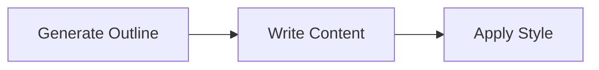

# Working with the intermediates 2 - Pocketflow for the AI agents

AI agents are basically AIs with specific tasks. They are connected each other and pass their deliverables to each other to perform a project with a series of fixed instructions and detailed instructions and prompts. In this tutorial, we use [Pocketflow](https://github.com/The-Pocket/PocketFlow/tree/main/cookbook) to show how you can do that with Python and local LLM (in Ollama).

## Structure

The basic structure of AI agents comes with *nodes*, *flows* and *shared*.

* Nodes - Steps that are performed by AI with tailored tasks (e.g. write an email with placeholder, list an organiztion of an essay)
* Flows - Orders of *nodes* for AIs to complete specific tasks
* Shared - Data that are being shared by the nodes in flows

<p align="center">

</p>

There are other ways to link them together for more complex (and useful) methods. But these are the basic three elements you can find in each AI agent. You can also check [Agent in PocketFlow](https://the-pocket.github.io/PocketFlow/design_pattern/agent.html) for details.

## What are we doing in the flow in [Tutorial Example](https://github.com/howardcheung/workshop-Interactive-AI-Agent/tree/main/Tutorial%20Example)?

In our previous tutorial, we have defined *nodes* in *nodes.py* and *flow* in *flow.py*. If you look at *flow.py* (which is from [Pockectflow](https://github.com/The-Pocket/PocketFlow/blob/main/cookbook/pocketflow-workflow/README.md))

```python
from pocketflow import Flow
from nodes import GenerateOutline, WriteSimpleContent, ApplyStyle

def create_article_flow():
    """
    Create and configure the article writing workflow
    """
    # Create node instances
    outline_node = GenerateOutline()
    write_node = WriteSimpleContent()
    style_node = ApplyStyle()
    
    # Connect nodes in sequence
    outline_node >> write_node >> style_node
    
    # Create flow starting with outline node
    article_flow = Flow(start=outline_node)
    
    return article_flow
```

You can see that we have three *nodes* with their flow defined by

```python
outline_node >> write_node >> style_node
```

to perform the following action, beginning from the *outline_node*:



This defines our flow for the agent. Now let's move to the controller of the flow - *app_pocket.py*!

## How are we controlling the data in the flow?

In *app_pocket.py*, we define *shared* and what we want as the final output at

```python
shared = {"topic": topic, 'final_output': ''}
```

and

```python
response = ''
output = {"response": response}
```

They are basically saying that we are storing the *shared* data in the form of a python dictionary and we are outputing the Content in the form of a string. The execution of the flow is performed by

```python
flow = create_article_flow()
flow.run(shared)
```

All other lines are just helping to refine the data for a nicer way to output.

## AI to be run by the node

The AI to be run by the node is stored in *utils/call_lm.py* as shown in

```python
import os
from openai import OpenAI

def call_llm(prompt):    
    client = OpenAI(base_url="http://localhost:11434/v1", api_key="ollama")
    r = client.chat.completions.create(
        model="llama3.2:3b",
        messages=[{"role": "user", "content": prompt}]
    )
    return r.choices[0].message.content

# Example usage
if __name__ == "__main__":
    print(call_llm("Tell me a short joke")) 
```

*base_url* is the api of the LLM (which is running on local now), *api_key* is the required key for online LLMs (can be anything for a local LLM), *model* is the type of model to be used, and *messages* is the structure of the message to be entered into the LLM. They all follow the same structure discussed in [OpenAI API Python Library](https://github.com/openai/openai-python).


## The Nodes

The nodes define what AI needs to do in each step. Consider the node *Generate Outline*, *nodes.py* define it as a Python Class object with the following functions:

* prep - to get the data to be passed to AI from *shared*
* exec - to execute the tasks. Usually started with prompt to define the task to be performed by the AI, and call the AI via call_llm function defined in utils/call_llm.py. *call_llm.py* calls the API of a local (like one run by Ollama) or an online LLM.
* post - run with input arguments *shared*, *prep_res* and *exec_res* to integrate deliverables from *exec* step into *shared* before the exeuction of next node

Remember what the tutorial is doing from the beginning to get a topic to write about from a user? In the first node *GenerateOutline*, the node does the following in each step:

* prep - get the topic from the user message
* exec - have a prompt to ask an LLM to output an outline of an essay on the topic with three main sections in the format of a yaml file. Then extract the topics from the LLM answer. In case of un-controllable actions from LLM that it doesn't give the structure correctly, ask the LLM again for another answer.
* post - get the initial draft of the sections into the *shared* variable for the next node to use

The *print* statements are there for you to check the operation logs in *Anaconda Prompt*. The eventual output would be output to the web interface via Streamlit in *app.py*.

## Try it yourself now!

Let's learn it by doing! Can you try to edit the prompt such that

* Use another LLM from Ollama and see how the outputs differ? Find another Ollama model, pull it and edit call_llm.py to do it. Which one do you prefer?
* Can you change *nodes.py* to add an abstract before all 3 main sections?